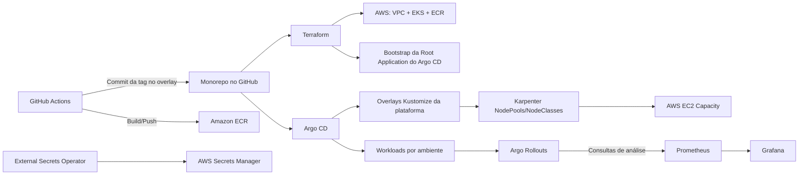

# Plataforma GitOps para AWS EKS (Argo CD + Argo Rollouts)

Repositório de referência pronto para produção de uma plataforma GitOps moderna na AWS com:

- Terraform para infraestrutura (`VPC`, `EKS`, `ECR`, IAM/IRSA, addons de bootstrap da plataforma)
- Argo CD para reconciliação declarativa
- Argo Rollouts para entrega progressiva (canary e blue/green)
- Karpenter para autoscaling de nós com foco em custo e utilização
- External Secrets Operator com AWS Secrets Manager
- Prometheus + Grafana + regras de alerta
- GitHub Actions com promoção estritamente orientada a Git (`dev -> stage -> prod`)

## Princípios centrais

- Git é a fonte da verdade para intenção de infraestrutura, manifests de plataforma e promoção de release.
- O CI nunca faz deploy direto no cluster.
- Argo CD é inicializado pelo Terraform e depois passa a gerenciar a si mesmo e o restante da plataforma.
- A promoção entre ambientes sempre é uma mudança em Git.
- Produção usa controles mais rígidos: sync manual, janela de sync e análise de rollout mais restritiva.

## Estrutura do repositório

```text
.
|-- .github/workflows/
|-- apps/
|   `-- sample-api/
|       |-- app/
|       |-- base/
|       `-- overlays/
|           |-- dev/
|           |-- stage/
|           `-- prod/
|-- argocd/
|   |-- applications/
|   |-- applicationsets/
|   |-- projects/
|   `-- root-app/
|-- bootstrap/
|   `-- argocd-bootstrap/
|-- docs/
|-- environments/
|   |-- dev/
|   |-- stage/
|   `-- prod/
|-- github-actions/
|   `-- scripts/
|-- platform/
|   |-- addons/
|   |-- argocd/
|   |-- argo-rollouts/
|   |-- external-secrets/
|   |-- ingress/
|   |-- karpenter/
|   |-- monitoring/
|   |-- namespaces/
|   |-- overlays/
|   `-- policies/
|-- scripts/
`-- terraform/
    |-- environments/
    `-- modules/
```

## Arquitetura de alto nível



## Modelo de bootstrap e responsabilidade

1. Terraform provisiona a base de infra (`infra-base.tf`) e addons (`platform-addons.tf`).
2. Terraform cria a `root-app` inicial no Argo CD.
3. A `root-app` também existe em Git e passa a se reconciliar (`argocd/root-app/root-application.yaml`).
4. Apps de plataforma e workloads são totalmente reconciliados pelo Argo CD a partir do Git.

Detalhes: [`docs/bootstrap.md`](docs/bootstrap.md)

## Deploy modular da plataforma

Os componentes de plataforma estao separados por `Application` no Argo CD:

- `platform-namespaces`
- `platform-ingress`
- `platform-external-secrets`
- `argocd-config`
- `platform-monitoring`
- `platform-argo-rollouts`
- `platform-kyverno-policies`
- `platform-karpenter`

Com isso, voce pode subir somente um modulo, por exemplo:

- pre-requisito no modo standalone (sem `root-app`):
  - `kubectl apply -n argocd -f argocd/projects/platform-project.yaml`

- somente Karpenter:
  - `kubectl apply -n argocd -f argocd/applications/platform-karpenter-app.yaml`
- somente configuracao do Argo CD:
  - `kubectl apply -n argocd -f argocd/applications/argocd-config-app.yaml`

Quando usar `root-app`, todos os modulos listados acima sao reconciliados automaticamente.

## Modelo de entrega progressiva

- `dev`: canary mais rápido, thresholds mais permissivos.
- `stage`: canary com múltiplos checkpoints de análise.
- `prod`: canary conservador (pause manual + thresholds mais estritos) ou blue/green opcional.
- Abort automático em caso de métricas não saudáveis via `AnalysisTemplate`.

Detalhes: [`docs/progressive-delivery.md`](docs/progressive-delivery.md)

## Modelo CI/CD (seguro para GitOps)

- Workflow `CI`: lint, testes, validação Terraform e validação de manifests.
- `Build Image and Update Dev Overlay`: build da imagem, push para ECR e update apenas da tag em Git no overlay `dev`.
- `Promote Image Between Environments`: abre PR para promoção `dev -> stage` e `stage -> prod`.
- Nenhum workflow aplica manifests diretamente no Kubernetes.

Detalhes: [`docs/promotion-flow.md`](docs/promotion-flow.md)

## Baseline de segurança e governança

- Namespaces dedicados por ambiente e por componente de plataforma.
- AppProjects com destinos restritos e escopo de papéis.
- Janela de sync em produção (`America/Sao_Paulo`) + sync manual.
- IRSA para AWS Load Balancer Controller e External Secrets Operator.
- Segredos em AWS Secrets Manager via External Secrets (sem credencial hardcoded de app).
- Políticas base com Kyverno incluídas.

## Inicio rapido

1. Copie as variáveis:
   - `cp terraform/environments/dev/terraform.tfvars.example terraform/environments/dev/terraform.tfvars`
2. Ajuste as variáveis obrigatórias (`region`, `domain_name`, `gitops_repo_url`, subnets/AZs).
3. Configure o repositório em `argocd/root-app/gitops-settings.yaml`.
4. Configure placeholders de domínio:
   - `make configure-domain DOMAIN=platform.example.com`
5. Configure placeholders de imagem ECR:
   - `make configure-ecr ECR_IMAGE=123456789012.dkr.ecr.us-east-1.amazonaws.com/sample-api`
6. Configure o cluster name usado pelo Karpenter:
   - `make configure-karpenter CLUSTER_NAME=gitops-dev`
7. Faça o bootstrap:
   - `make terraform-apply ENV=dev`
8. Valide:
   - `kubectl -n argocd get applications`
   - `kubectl -n argocd get app root-app`

## Comandos de operacao continua

- `make terraform-fmt`
- `make terraform-validate ENV=dev`
- `make validate-kustomize`
- `make lint-sample`
- `make test-sample`
- `./scripts/set-rollout-strategy.sh bluegreen`
- `./scripts/set-rollout-strategy.sh canary`

## Mapa da documentação

- Arquitetura: [`docs/architecture.md`](docs/architecture.md)
- Inicializacao: [`docs/bootstrap.md`](docs/bootstrap.md)
- Promoção: [`docs/promotion-flow.md`](docs/promotion-flow.md)
- Deploy modular: [`docs/platform-modules.md`](docs/platform-modules.md)
- Entrega progressiva: [`docs/progressive-delivery.md`](docs/progressive-delivery.md)
- Guia operacional: [`docs/operations-runbook.md`](docs/operations-runbook.md)
- Rollback: [`docs/rollback.md`](docs/rollback.md)
- Segredos: [`docs/secrets.md`](docs/secrets.md)
- Karpenter e otimizacao de nos: [`docs/karpenter.md`](docs/karpenter.md)
- OIDC: [`docs/oidc.md`](docs/oidc.md)
- Solucao de problemas: [`docs/troubleshooting.md`](docs/troubleshooting.md)
- Decisões e trade-offs: [`docs/decisions.md`](docs/decisions.md)

## Licenca

Este projeto esta licenciado sob a Apache License 2.0. Consulte o arquivo `LICENSE` para mais detalhes.

## Atribuicao

Este projeto foi desenvolvido e publicado por **Tharlesson**.
Caso voce utilize este material como base em ambientes internos, estudos, adaptacoes ou redistribuicoes, preserve os creditos de autoria e os avisos de licenca aplicaveis.

## Creditos e Uso

Este repositorio foi criado com foco em automacao, padronizacao operacional e melhoria da rotina de profissionais de SRE, DevOps, Cloud e Plataforma.

Voce pode:
- estudar
- reutilizar
- adaptar
- evoluir este projeto dentro do seu contexto

Ao reutilizar ou derivar este material:
- mantenha os avisos de licenca
- preserve os creditos de autoria quando aplicavel
- documente alteracoes relevantes feitas sobre a base original

## Autor

**Tharlesson**  
GitHub: https://github.com/tharlesson
